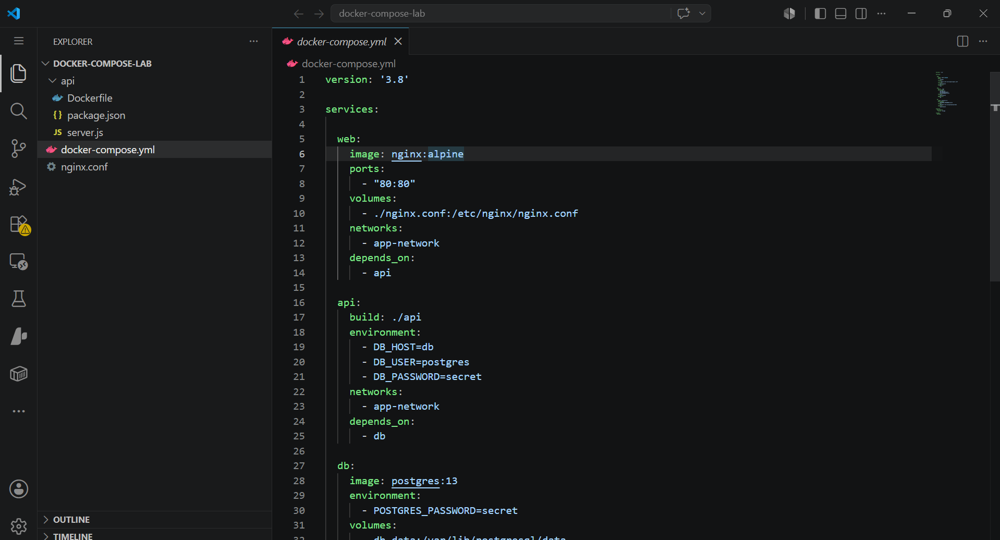
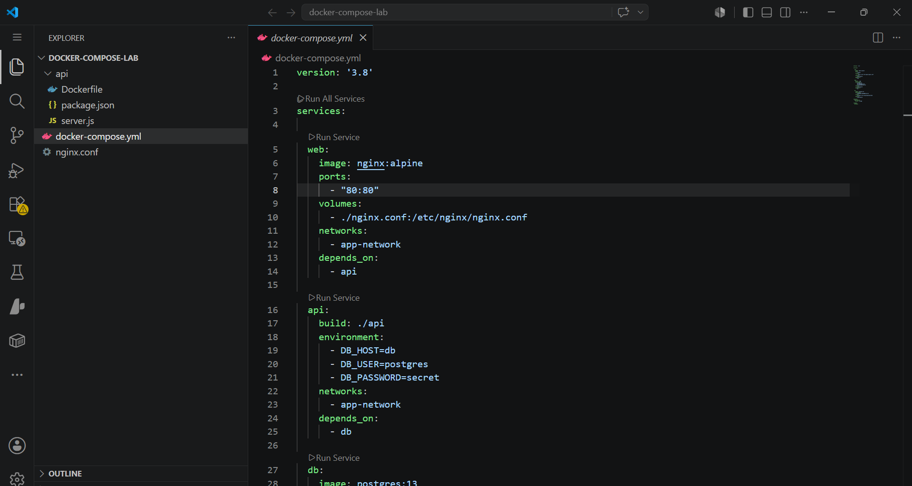
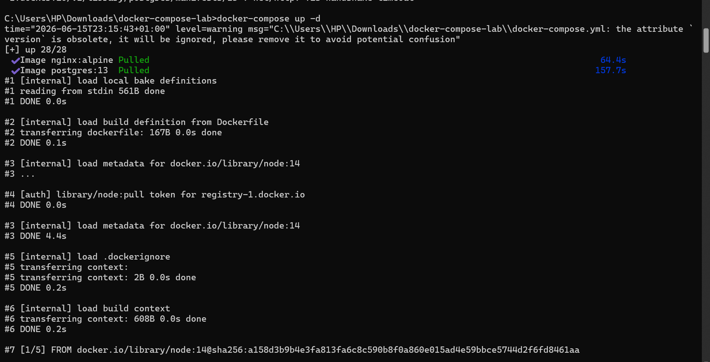

# 🐳 Docker Compose Multi-Container Application


---

# 📌 Project Overview

This project demonstrates how to deploy and manage a multi-container application using Docker Compose.

The application consists of:

- 🌐 Nginx Web Server
- ⚙️ Node.js API
- 🗄️ PostgreSQL Database
- 🔗 Docker Network
- 💾 Docker Volume

The goal of this project was to understand how Docker Compose simplifies application deployment by managing multiple services from a single configuration file.

---

# 🎯 Business Problem

Modern applications consist of multiple components that must work together reliably.

Without container orchestration:

- Environment setup becomes inconsistent.
- Deployments become error-prone.
- Onboarding new developers takes longer.
- Applications become difficult to maintain.

Docker Compose solves these challenges by defining the entire application stack as code, ensuring consistency and repeatability.

---

# 🚀 Solution

This project uses Docker Compose to orchestrate:

| Service | Purpose |
|----------|----------|
| Nginx | Handles incoming web requests |
| Node.js API | Processes application logic |
| PostgreSQL | Stores application data |
| Docker Network | Enables secure communication |
| Docker Volume | Preserves database data |

---

# 🏗️ Architecture

```text
Browser
   │
   ▼
Nginx Container
   │
   ▼
Node.js API Container
   │
   ▼
PostgreSQL Container
```

---

# 📂 Project Structure

```text
docker-compose-multi-container-app/
│
├── docker-compose.yml
├── nginx.conf
├── README.md
│
├── api/
│   ├── Dockerfile
│   ├── package.json
│   └── server.js
│
└── screenshots/
    ├── project-structure.png
    ├── docker-compose-yml.png
    ├── compose-up.png
    ├── compose-ps.png
    ├── browser-output.png
    ├── volume-list.png
    └── network-list.png
```

---

# 🖼️ Project Screenshots

## Project Structure



---

## Docker Compose Configuration



---

## Deploying the Application Stack



---

## Application Running in Browser


---

# ⚙️ Technologies Used

- Docker
- Docker Compose
- Nginx
- Node.js
- PostgreSQL
- YAML

---

# 🔍 Key Concepts Demonstrated

## Docker Compose

Managing multiple containers from a single configuration file.

## Container Networking

Allowing services to communicate securely.

## Persistent Storage

Using Docker volumes to preserve data.

## Infrastructure as Code (IaC)

Managing infrastructure using code rather than manual configuration.

## Service Orchestration

Coordinating application components efficiently.

---

# ▶️ Commands Used

## Start Services

```bash
docker compose up -d
```

## Check Running Containers

```bash
docker compose ps
```

## View Logs

```bash
docker compose logs
```

## Stop Services

```bash
docker compose down
```

## Remove Services and Volumes

```bash
docker compose down -v
```

---

# 📈 Business Value

This project demonstrates how organizations can:

- Improve deployment consistency
- Reduce configuration errors
- Increase developer productivity
- Simplify environment setup
- Improve system reliability
- Support scalable application architectures

These benefits contribute to faster software delivery and reduced operational costs.

---

# 🎯 Relevance to Data Engineering

Data engineering platforms commonly include multiple services such as:

- PostgreSQL
- Apache Airflow
- Apache Spark
- Kafka
- Monitoring Tools

Docker Compose provides a reproducible way to deploy and manage these services, making it an essential skill for modern Data Engineers.

---

# 🧠 Lessons Learned

Through this project, I learned:

- Multi-container deployment
- Container networking
- Data persistence using volumes
- Docker Compose orchestration
- Infrastructure as Code principles
- Service dependency management

---

# 👨‍💻 Author

**Wisdom Oghenevwede Uti**

Aspiring Data Engineer | ALX Data Science Learner

Building skills in:

- Data Engineering
- Python
- SQL
- Docker
- Cloud Computing
- Data Pipelines
- Modern Data Platforms
